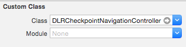
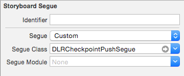
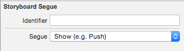
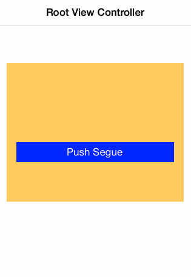

# DLRCheckpointNavigationController

[](https://travis-ci.org/detroit-labs/dlr-checkpoint-navigation-controller-ios)
[](http://cocoadocs.org/docsets/DLRCheckpointNavigationController)
[](http://cocoadocs.org/docsets/DLRCheckpointNavigationController)
[](http://cocoadocs.org/docsets/DLRCheckpointNavigationController)

## Installation

DLRCheckpointNavigationController is available through [CocoaPods](http://cocoapods.org). To install
it, simply add the following line to your Podfile:

```rb
pod "DLRCheckpointNavigationController"
```

## Author

Nathan Walczak, nate.walczak@detroitlabs.com

## License

DLRCheckpointNavigationController is available under the MIT license. See the LICENSE file for more info.

## Examples

##### UINavigationController identity inspector settings


##### Storyboard Segue attributes inspector settings
Standard Push Segue | Checkpoint Push Segue
------------------- | ---------------------
 | 

##### Recording of iOS device

